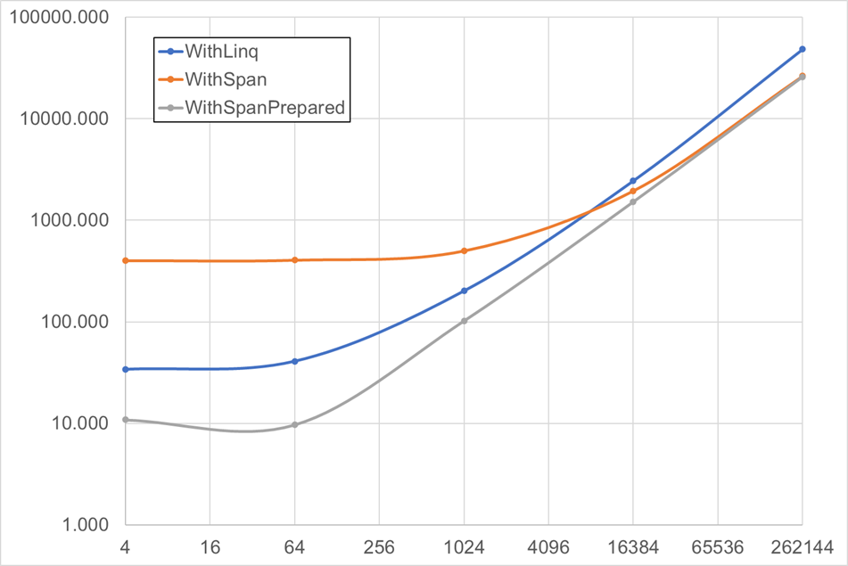

## Result

- `SearchValues` を再利用できる場合は `ReadOnlySpan` の `ContainsAny()` が安定して速い
- 対象の文字列が長い場合は `ReadOnlySpan` の `ContainsAny()` が、短い場合は LINQ が速い

```
BenchmarkDotNet v0.14.0, Windows 11 (10.0.26100.3194)
Intel Core i7-10700 CPU 2.90GHz, 1 CPU, 16 logical and 8 physical cores
.NET SDK 9.0.200
  [Host]     : .NET 9.0.2 (9.0.225.6610), X64 RyuJIT AVX2
  DefaultJob : .NET 9.0.2 (9.0.225.6610), X64 RyuJIT AVX2
```

| Method           | N      | Case  | Mean          | Error       | StdDev      | Gen0   | Gen1   | Allocated |
|----------------- |------- |------ |--------------:|------------:|------------:|-------:|-------:|----------:|
| WithLinq         | 4      | False |     34.146 ns |   0.2388 ns |   0.2233 ns | 0.0114 |      - |      96 B |
| WithSpan         | 4      | False |    402.358 ns |   3.7895 ns |   3.5447 ns | 0.1884 | 0.0010 |    1576 B |
| WithSpanPrepared | 4      | False |     10.848 ns |   0.0092 ns |   0.0076 ns |      - |      - |         - |
| WithLinq         | 4      | True  |     18.263 ns |   0.2407 ns |   0.2251 ns | 0.0115 |      - |      96 B |
| WithSpan         | 4      | True  |    407.784 ns |   5.6476 ns |   5.2828 ns | 0.1884 | 0.0010 |    1576 B |
| WithSpanPrepared | 4      | True  |     11.358 ns |   0.0042 ns |   0.0035 ns |      - |      - |         - |
| WithLinq         | 64     | False |     41.034 ns |   0.3539 ns |   0.3310 ns | 0.0114 |      - |      96 B |
| WithSpan         | 64     | False |    406.099 ns |   5.5903 ns |   5.2292 ns | 0.1884 | 0.0010 |    1576 B |
| WithSpanPrepared | 64     | False |      9.686 ns |   0.0053 ns |   0.0045 ns |      - |      - |         - |
| WithLinq         | 64     | True  |     19.970 ns |   0.2110 ns |   0.1870 ns | 0.0115 |      - |      96 B |
| WithSpan         | 64     | True  |    407.653 ns |   5.7592 ns |   5.3871 ns | 0.1884 | 0.0010 |    1576 B |
| WithSpanPrepared | 64     | True  |     12.625 ns |   0.0095 ns |   0.0084 ns |      - |      - |         - |
| WithLinq         | 1024   | False |    202.036 ns |   0.3079 ns |   0.2730 ns | 0.0114 |      - |      96 B |
| WithSpan         | 1024   | False |    501.027 ns |   5.3079 ns |   4.9650 ns | 0.1879 | 0.0010 |    1576 B |
| WithSpanPrepared | 1024   | False |    102.175 ns |   0.0947 ns |   0.0840 ns |      - |      - |         - |
| WithLinq         | 1024   | True  |     19.331 ns |   0.2029 ns |   0.1898 ns | 0.0115 |      - |      96 B |
| WithSpan         | 1024   | True  |    409.643 ns |   4.2793 ns |   4.0028 ns | 0.1884 | 0.0010 |    1576 B |
| WithSpanPrepared | 1024   | True  |     14.569 ns |   0.0065 ns |   0.0058 ns |      - |      - |         - |
| WithLinq         | 16384  | False |  2,451.188 ns |   2.9492 ns |   2.7587 ns | 0.0114 |      - |      96 B |
| WithSpan         | 16384  | False |  1,953.101 ns |   5.0902 ns |   4.5123 ns | 0.1869 |      - |    1576 B |
| WithSpanPrepared | 16384  | False |  1,521.691 ns |   2.2700 ns |   2.1234 ns |      - |      - |         - |
| WithLinq         | 16384  | True  |     19.285 ns |   0.1520 ns |   0.1422 ns | 0.0115 |      - |      96 B |
| WithSpan         | 16384  | True  |    410.603 ns |   3.6750 ns |   3.4376 ns | 0.1884 | 0.0010 |    1576 B |
| WithSpanPrepared | 16384  | True  |     12.308 ns |   0.0076 ns |   0.0068 ns |      - |      - |         - |
| WithLinq         | 262144 | False | 48,452.787 ns |  36.1770 ns |  32.0699 ns |      - |      - |      96 B |
| WithSpan         | 262144 | False | 26,382.008 ns |  16.5176 ns |  13.7929 ns | 0.1831 |      - |    1576 B |
| WithSpanPrepared | 262144 | False | 25,888.941 ns | 136.2801 ns | 120.8088 ns |      - |      - |         - |
| WithLinq         | 262144 | True  |     20.070 ns |   0.2240 ns |   0.2096 ns | 0.0115 |      - |      96 B |
| WithSpan         | 262144 | True  |    413.106 ns |   4.3953 ns |   4.1114 ns | 0.1884 | 0.0010 |    1576 B |
| WithSpanPrepared | 262144 | True  |     12.187 ns |   0.2669 ns |   0.3177 ns |      - |      - |         - |


